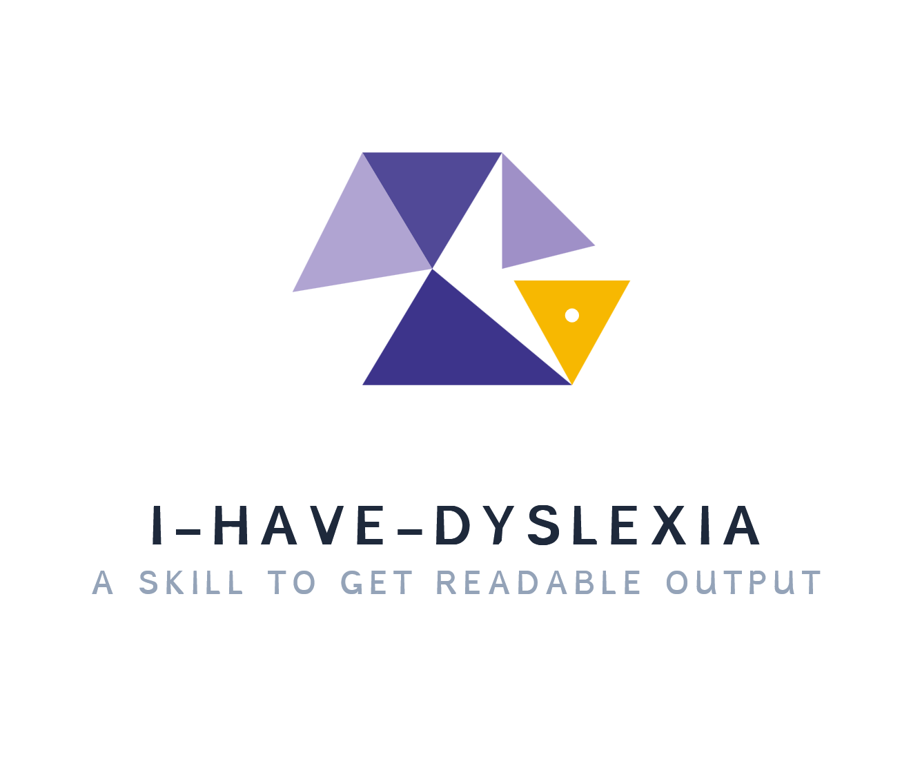

<p align="center">
  
</p>

# i-have-dyslexia

**Versão 1.1.2**

Uma resposta de IA pode ser útil e ainda assim cansar na hora de ler.

`i-have-dyslexia` muda o **formato da resposta**. O conteúdo importante continua lá.

A ideia é simples: deixar o texto mais fácil de decodificar e escanear.

[English](README.md) · [Guia completo de instalação](INSTALL.md)

## O que muda

Quando a skill está ativa, o assistente deve:

- usar **frases curtas** com uma ideia principal;
- dividir o texto em **blocos pequenos** com mais espaço;
- preferir **palavras simples** e explicar termos técnicos uma vez;
- usar **listas e títulos claros** quando ajudam;
- manter **código, números, citações e texto legal ou médico exatos** quando a precisão importa.

Existe **uma única skill**. As regras ficam em [`skills/i-have-dyslexia/SKILL.md`](skills/i-have-dyslexia/SKILL.md).

## Como ativar

Use o nome da skill:

```text
/i-have-dyslexia
```

Alguns apps também oferecem atalhos como:

```text
\dys
/dys
```

Esses atalhos chamam a mesma skill. Eles não são skills separadas.

Para desligar o modo, diga:

```text
stop dyslexia mode
```

ou:

```text
normal mode
```

## Instalação

Escolha a ferramenta que você usa.

### Claude Code

```text
/plugin marketplace add bluemozilla/i-have-dyslexia
/plugin install i-have-dyslexia@bluemozilla-skills
/i-have-dyslexia:i-have-dyslexia
```

### Gemini CLI

```bash
gemini extensions install https://github.com/bluemozilla/i-have-dyslexia
```

### Qwen Code

```bash
qwen extensions install bluemozilla/i-have-dyslexia
```

Depois use `/i-have-dyslexia`.

### Kimi Code CLI

```text
/plugins install https://github.com/bluemozilla/i-have-dyslexia
/reload
/skill:i-have-dyslexia
```

### Pi

```bash
pi install git:github.com/bluemozilla/i-have-dyslexia
```

No Pi funcionam `\dys`, `/dys`, `/i-have-dyslexia` e `--dyslexia`.

### Cursor e outros hosts de Agent Skills

A skill fica em:

```text
skills/i-have-dyslexia/
```

Copie essa pasta para o diretório de skills aceito pelo seu app.

Veja [INSTALL.md](INSTALL.md) para detalhes de cada ferramenta.

## Sobre a persistência

A skill pede para o assistente manter o modo ativo até você desligar.

Alguns apps podem recarregar skills de formas diferentes entre mensagens.

**No Pi, o estado fica salvo na sessão**, então o modo continua ativo até você desativar.

## Licença

MIT. Veja [LICENSE](LICENSE).

Mantido por [bluemozilla](https://github.com/bluemozilla).
